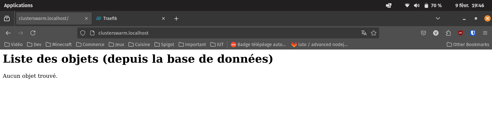

# TP de Virtualisation - Valentin ROMANET
Ce rendu présente ma réalisation du TP de virtualisation, qui consistait en un déploiement d'un ensemble de services sur un cluster Swarm, accessibles via un seul point d'entrée : l'ingress Traefik.

## Sommaire
- [Introduction](#introduction)
- [Travail Réalisé](#travail-réalisé)
  - [Ce que j'ai réussi à faire](#ce-que-jai-réussi-à-faire)
  - [Les problèmes rencontrés](#les-problèmes-rencontrés)
  - [Arborescence du projet](#arborescence-du-projet)
  - [Organisation des réseaux](#organisation-des-réseaux)
  - [Mise en place du Basic-Auth](#mise-en-place-du-basic-auth)
- [Déploiement du TP de Virtualisation](#déploiement-du-tp-de-virtualisation)
    - [Mise en place du cluster Swarm](#mise-en-place-du-cluster-swarm)
    - [Construction des images](#construction-des-images)
        - [Service Apache](#service-apache)
        - [Service Cluster Swarm](#service-cluster-swarm)
        - [Service Flask](#service-flask)
        - [Service Fortune](#service-fortune)
        - [Service Utilisateurs](#service-utilisateurs)
    - [Construction des réseaux](#construction-des-réseaux)
    - [Services déployés](#services-déployés)
        - [Service Apache](#service-apache-1)
        - [Service Cluster Swarm](#service-cluster-swarm-1)
        - [Service Flask](#service-flask-1)
        - [Service Fortune](#service-fortune-1)
        - [Service Utilisateurs](#service-utilisateurs-1)
    - [Nettoyage](#nettoyage)

## Introduction
J'ai débuté la réalisation de ce TP sur les machines de l'IUT, en créant un cluster Swarm ave les trois machines virtuelles mises à notre disposition. J'ai rencontré divers problèmes aux niveau des noeuds du cluster ainsi qu'au niveau de la consommation des ressources des machines, ce qui m'a poussé à continuer le TP sur mon ordinateur personnel.  

Pour ce faire, j'ai décidé de déployer un cluster Swarm ne possédant qu'un seul noeud sur mon ordinateur personnel, ce qui m'a permis de déployer les services sans rencontrer de problèmes.  

J'ai tout de même déployé certains services sur le cluster Swarm de l'IUT. Pour y accéder, on doit effectuer deux commandes de rebond SSH, un pour le port 8080 et un pour le port 80.  
IP de la machine : `o22202473-221`  

Rebond SSH pour le port 8080 :
```bash
ssh -L 8080:o22202473-221:8080 -N pXXXXXX@acces-tp.iut45.univ-orleans.fr 
```

Rebond SSH pour le port 80 :
```bash
ssh -L 8000:o22202473-221:80 -N pXXXXXX@acces-tp.iut45.univ-orleans.fr 
```

Pour accéder aux quelques services disponibles, il suffit de se rendre sur les liens suivants :
- Dashboard Traefik : `localhost:8080`
- Fortune : `fortune.localhost:8000`
- Utilisateurs : `utilisateurs.localhost:8000`
- Apache : `localhost:8000/apache`

## Travail Réalisé
### Ce que j'ai réussi à faire
Lors de ce TP de Virtualisation, j'ai réussi à déployer presque tous les services comme demandés. Tous les services fonctionnent et sont protégés par un Basic-Auth sur lequel je reviendrai plus tard.  

Au niveau de mes choix d'organisation, j'ai structuré mon TP en créant un dossier par service, avec un docker-compose associé et un Dockerfile si besoin. On retrouvait également les fichier nécessaires à l'affichage des services comme des index ou des fichiers python (pour flask).  

### Les problèmes rencontrés
Au niveau des problèmes rencontrés, j'ai eu des difficultés à faire fonctionner le cluster avec plusieurs noeuds, notamment au niveau de la communication entre les noeuds. J'ai donc décidé de déployer un cluster avec un seul noeud sur mon ordinateur personnel.  

J'ai également rencontré des problème au niveau des volume gluster, qui découlent de ma décision de déployer un cluster avec un seul noeud. En effet, les volumes gluster ne fonctionnent pas avec un seul noeud. J'ai donc décidé de ne pas utiliser de volumes gluster pour ce TP.  

Pour finir, j'ai eu des difficultés à mettre en place le Basic-Auth pour protéger les services. J'ai finalement réussi à le mettre en place en utilisant un fichier de config Traefik, et en utilisant le middleware auth@file dans mes fichiers docker-compose.

### Arborescence du projet
- `./apache` : Le serveur apache accessible via un sous-domaine
- `./clusterswarm` : Le site web du cluster Swarm affichant une liste d'objets depuis une BD mysql ou redis.
- `./flask` : L'API REST sous flask.
- `./fortune` : Le service Fortune.
- `./traefik` : Le service Traefik pour accéder au Dashboard et gérer les services.
- `./utilisateurs` : Le site web affichant une liste d'utilisateurs depuis une BD mysql ou  redis.
- `./img` : les images utilisées dans le rapport.
- `build-image.sh` : script pour lancer le build de toutes les images nécessaires.
- `create-networks.sh` : script pour créer tous les réseaux nécessaires.
- `deploy-stack.sh` : script pour déployer tous les services sous forme de stack.
- `destroy-stack.sh` : script pour détruire toutes les stacks (services).

### Organisation des réseaux
Au niveau de mes choix pour le réseau, j'ai décidé d'en créer un public accessible aux web de tous les services et à Traefik afin que Traefik puisse fonctionner correctement. J'ai ensuite créé des réseaux internes aux services pour reliés les éventuelles base de données ou redis présent. Ces réseaux évitent que tout soit accessible sur le réseau principal et visible depuis Traefik.

### Mise en place du Basic-Auth
Pour mettre en place le Basic-Auth, j'ai créé un fichier de configuration Traefik contenant un utilisateur admin et son mot de passe. J'ai ensuite utilisé ce fichier dans le docker-compose de mon Traefik pour ajouter le middleware auth@file.  
Il ne restait plus qu'à ajouter le label `traefik.http.routers.<nom_service>.middlewares=auth@file` dans les services que je voulais protéger.  

Voici les identifiants pour accéder aux services protégés :  
| Utilisateur | Mot de passe |
| --- | --- |
| admin | admin |

## Déploiement du TP de Virtualisation
>Si rien n'est indiqué, on exécute les commandes depuis la racine du répertoire.
### Mise en place du cluster Swarm
Pour mettre en place le cluster Swarm, il suffit d'effectuer la commande suivante :
```bash
docker swarm init
```

Je n'ai pas utilisé d'autre noeud sur mon cluster Swarm. Cependant, si l'on souhaite ajouter un noeud, il suffit d'effectuer la commande suivante sur le noeud que l'on souhaite ajouter :
```bash
docker swarm join --token <token> <adresse_ip_manager>:2377
```

### Construction des images
Chaque service utilise une image différente que l'on doit construire à partir de son Dockerfile.  
Pour construire toutes les images d'un coup, on lance le script : 
```bash
sh build-images.sh
```

Si on veut les construire une par une :   
#### Service Apache
```bash
docker build -t apache:latest apache/
```

#### Service Cluster Swarm
```bash
docker build -t clusterswarm:latest clusterswarm/
```

#### Service Flask
```bash
docker build -t flask:latest flask/
```

#### Service Fortune
```bash
docker build -t fortune:latest fortune/
```

#### Service Utilisateurs
```bash
docker build -t utilisateurs:latest utilisateurs/
```

### Construction des réseaux
Certains services utilisent un réseau privé que l'on doit construire. Le réseau commun doit aussi être construit.  
Pour construire tous les réseaux d'un coup, on lance le script : 
```bash
sh create-netorks.sh
```

Si on veut les construire un par un :   
```bash
docker network create publicswarm --attachable -d overlay
docker network create clusterswarm --attachable -d overlay
docker network create flask --attachable -d overlay
docker network create utilisateurs --attachable -d overlay
```

### Services déployés
> Les services présentés ci-dessous sont ceux déployés sur mon cluster Swarm personnel.  

On peut déployer tous les services d'un coup. Il faut cependant d'abord lancer Traefik seul :
```bash
docker stack deploy -c traefik/docker-compose.yml traefik --detach

sh deploy-stack.sh
```

#### Service Apache
[](img/apache.png)

Pour déployer le service Apache :  
```bash
docker stack deploy -c apache/docker-compose.yml apache --detach
```

#### Service Cluster Swarm
[](img/clusterswarm.png)

Pour déployer le service Cluster Swarm :  
```bash
docker stack deploy -c clusterswarm/docker-compose.yml clusterswarm --detach
```

#### Service Flask
GET via l'API REST Flask :  
[](img/flask_get.png)

POST via l'API REST Flask :  
[](img/flask_post.png)

Pour déployer le service Flask :  
```bash
docker stack deploy -c flask/docker-compose.yml flask --detach
```

#### Service Fortune
[](img/fortune.png)

Pour déployer le service Fortune :  
```bash
docker stack deploy -c fortune/docker-compose.yml fortune --detach
```

#### Service Utilisateurs
[](img/utilisateurs.png)

Pour déployer le service Utilisateurs :  
```bash
docker stack deploy -c utilisateurs/docker-compose.yml utilisateurs --detach
```

### Nettoyage
Il est possible de détruire tous les services déployés en une seule commande :  
```bash
sh destroy-stack.sh
```

Il faut ensuite détruire le Traefik :  
```bash
docker stack rm traefik
```

## Récapitulatif des services
| Service | URL |
| --- | --- |
| Apache | [localhost/apache](localhost/apache) |
| Cluster Swarm | [clusterswarm.localhost](clusterswarm.localhost) |
| Flask | [flask.localhost](flask.localhost) |
| Fortune | [fortune.localhost](fortune.localhost) |
| Utilisateurs | [utilisateurs.localhost](utilisateurs.localhost) |
| Traefik Dashboard | [localhost:8080](localhost:8080) |